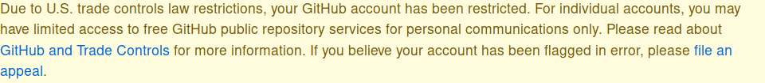

# Unban Github :)

A firefox extension to remove yellow ".flash-warn" bar from Github.com

## How to use

- Clone the repo: `git clone https://github.com/yaa110/unban-github.git`
- Navigate to `about:addons` in firefox
- Click settings button and select `Install Add-on From File` menu
- Select `unban_github-1.1-an+fx.xpi` from `artifacts` folder 
- **or manually build and sign the extension**

